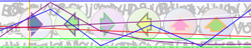

# Simple CAPTCHA for Ninja School

A robust, thread-safe CAPTCHA implementation designed specifically for Ninja School game servers to prevent automated bots and ensure human player verification.

## 🎯 Features

- **Arrow-based Visual Challenge**: Players must identify and input arrow directions in sequence
- **Multi-zoom Support**: Supports 4 different zoom levels (1x to 4x) for various Ninja School client resolutions
- **Thread-safe Design**: Concurrent hash map and synchronized operations for multi-player Ninja School environments
- **Memory Efficient**: Automatic resource cleanup and disposal mechanisms
- **Failure Handling**: Configurable failure limits with automatic regeneration
- **Image Compression**: Optimized PNG output with quality control

## 📋 Requirements

- **Java**: JDK 21 or higher
- **Dependencies**: Standard Java libraries (no external dependencies required)

## 🚀 Installation & Integration

### 1. Add CAPTCHA Files

Copy the following files to your project:
- `CaptchaManager.java`
- `CaptchaGenerator.java` 
- `CaptchaResult.java`

### 2. Player Class Modification

Add the captcha field to your Player/Char class:

```java
public class Char {
    // ... existing fields
    public byte captcha = 0; // 0 = no captcha, 1 = captcha required
    // ... rest of class
}
```

### 3. Service Class Integration

Add these methods to your `Service` class:

```java
public void addItemCaptcha(Char player) {
    try {
        CaptchaResult captchaResult = CaptchaManager.getInstance().getCaptcha(player.user.id);
        if(captchaResult == null){
            return;
        }
        Message m = new Message(CMD.ITEMMAP_ADD);
        DataOutputStream ds = m.writer();
        ds.writeShort(-1);
        ds.writeShort(-1);
        ds.writeShort(player.x); // X coordinate of image
        ds.writeShort(player.y - 90); // Y coordinate of image
        byte[] data = captchaResult.getImageBytes();
        if(data != null){
            ds.writeInt(data.length);
            ds.write(data);
        }
        ds.flush();
        sendMessage(m);
        m.cleanup();
    } catch (IOException ex) {
        Log.error("add item err: " + ex.getMessage(), ex);
    }
}

public void loadInfo() {
    try {
        Message ms = messageSubCommand(CMD.ME_LOAD_INFO);
        DataOutputStream ds = ms.writer();
        ds.writeInt(player.getCoinInt());
        ds.writeInt(player.getYenInt());
        ds.writeInt(player.user.gold);
        ds.writeInt((int)player.hp);
        ds.writeInt((int)player.mp);
        ds.writeByte(player.captcha);
        ds.flush();
        sendMessage(ms);
        ms.cleanup();
    } catch (IOException ex) {
        Log.error("load info err: " + ex.getMessage(), ex);
    }
}
```

### 4. Message Handler Integration

In your `messageNotMap` method, find case 122 and add:

```java
case 122:
    if (type == 4) {
        CaptchaManager.getInstance().handlePlayerCaptchaInput(_char, mss.reader().readByte());
    }
    break;
```

### 5. Player Login Integration

When a player enters the game, call:

```java
// Send existing captcha on login
player.zone.getService().addItemCaptcha(player);
```

## 🛡️ Usage Examples

### Generating CAPTCHA for Player

```java
// Generate captcha when needed (e.g., suspicious activity detected)
CaptchaManager.getInstance().generateCaptchaForPlayer(player);
```

### Restricting Actions When CAPTCHA Required

```java
// Before allowing skill usage
if (CaptchaManager.getInstance().containsCaptcha(player.user.id)) {
    // Send message to player: "Please solve CAPTCHA first"
    return;
}

// Before item usage
if (CaptchaManager.getInstance().containsCaptcha(player.user.id)) {
    // Block item usage
    return;
}

// Before shop purchases
if (CaptchaManager.getInstance().containsCaptcha(player.user.id)) {
    // Block transaction
    return;
}

// Before trading
if (CaptchaManager.getInstance().containsCaptcha(player.user.id)) {
    // Block trade initiation
    return;
}
```

### Manual CAPTCHA Management

```java
// Check if player has pending captcha
boolean hasCaptcha = CaptchaManager.getInstance().containsCaptcha(playerId);

// Get captcha result
CaptchaResult result = CaptchaManager.getInstance().getCaptcha(playerId);

// Remove captcha manually
CaptchaManager.getInstance().removeCaptcha(playerId);
```

## 🎨 CAPTCHA Challenge Format

The CAPTCHA presents 6 arrows in circles, each pointing in one of three directions:
- **UP** (Code: 1)
- **LEFT** (Code: 0) 
- **RIGHT** (Code: 2)

Players must input the sequence of arrow directions from left to right.

### Demo Images



## ⚙️ Configuration

### Default Settings

```java
private static final int DEFAULT_MAX_FAILURES = 10; // Max wrong attempts before regeneration
private static final int BASE_WIDTH = 180;          // Base image width
private static final int BASE_HEIGHT = 35;          // Base image height
private static final int ARROW_COUNT = 6;           // Number of arrows per captcha
```

## 🔒 Security Features

### Thread Safety
- `ConcurrentHashMap` for session storage
- Synchronized blocks for critical operations
- Atomic operations for disposal state

### Memory Management
- Automatic resource cleanup
- Explicit disposal methods
- Weak reference handling for garbage collection

### Input Validation
- Range checking for arrow directions (0-2)
- Length limits on input sequences
- Automatic sequence trimming

### Failure Protection
- Configurable failure thresholds
- Automatic CAPTCHA regeneration
- Session timeout handling

## 🏆 Advantages

✅ **Lightweight**: No external dependencies  
✅ **High Performance**: Optimized image generation  
✅ **Thread-Safe**: Concurrent player support  
✅ **Memory Efficient**: Automatic cleanup  
✅ **Scalable**: Handles multiple zoom levels  
✅ **Secure**: Input validation and failure handling  
✅ **Easy Integration**: Minimal code changes required  
✅ **Visual Appeal**: Gradient backgrounds and effects  

## 🐛 Troubleshooting

### Common Issues

**Image not displaying:**
- Check if `addItemCaptcha` is called after generating CAPTCHA
- Verify image bytes are not null
- Ensure proper message format

**Input not registering:**
- Confirm case 122 handler is added
- Verify byte range (0-2) for input
- Check if CAPTCHA session exists

**Memory leaks:**
- Ensure `dispose()` is called on completion
- Check for orphaned sessions
- Monitor `activeCaptchas` map size

### Debug Commands

```java
// Check active sessions
int activeSessions = CaptchaManager.getInstance().getActiveSessionCount();

// Verify session exists
boolean exists = CaptchaManager.getInstance().containsCaptcha(playerId);

// Get failure count
CaptchaResult result = CaptchaManager.getInstance().getCaptcha(playerId);
int failures = result != null ? result.getFailCount() : 0;
```

## 📝 License

This CAPTCHA system is designed specifically for Ninja School private servers for educational and development purposes. Please ensure compliance with your server's terms of service and applicable laws.

## 🤝 Contributing

1. Fork the repository
2. Create a feature branch
3. Implement your changes
4. Add tests if applicable  
5. Submit a pull request

## 📞 Support

For questions, issues, or suggestions:
- Create an issue in this repository
- Check existing documentation
- Review the troubleshooting section

---

*Simple CAPTCHA for Ninja School - Developed with ☕ and Java 21*
